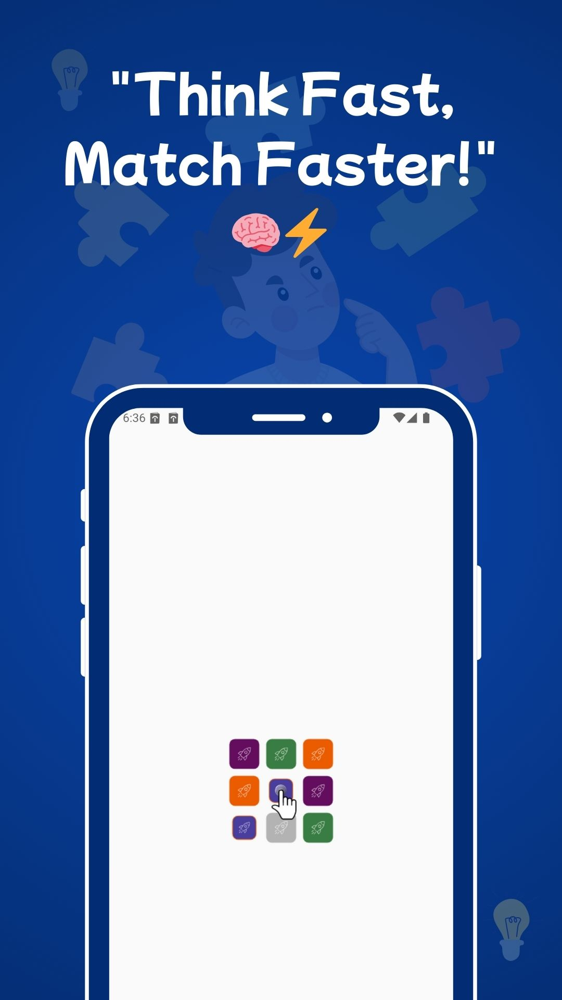
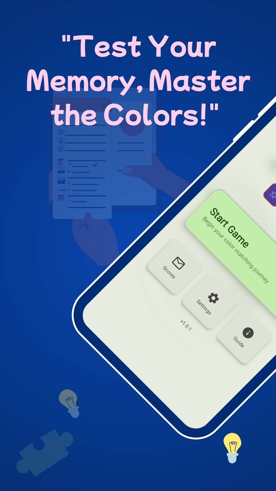
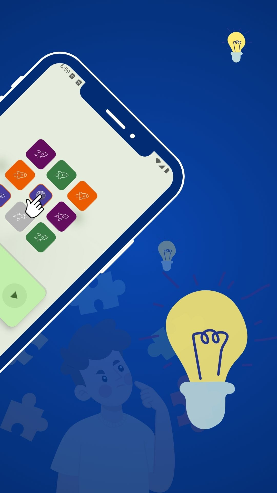
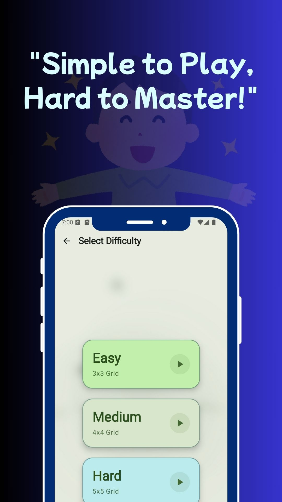
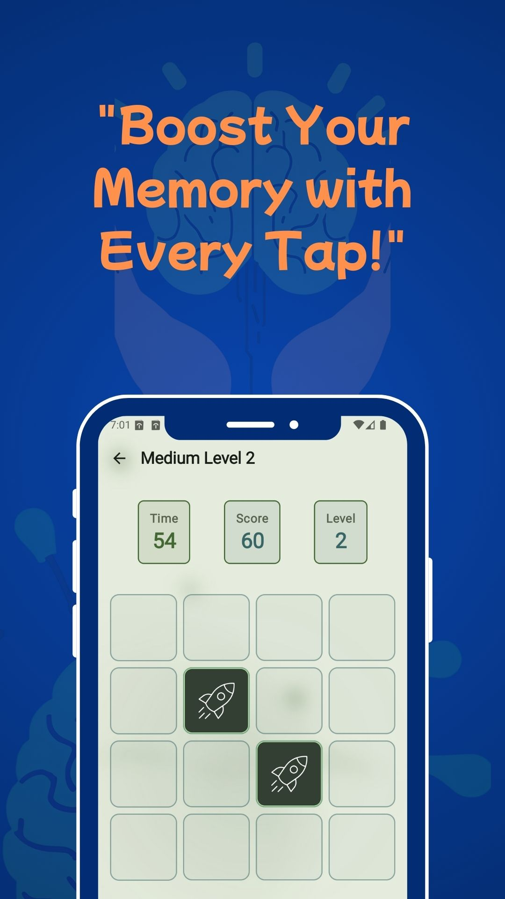
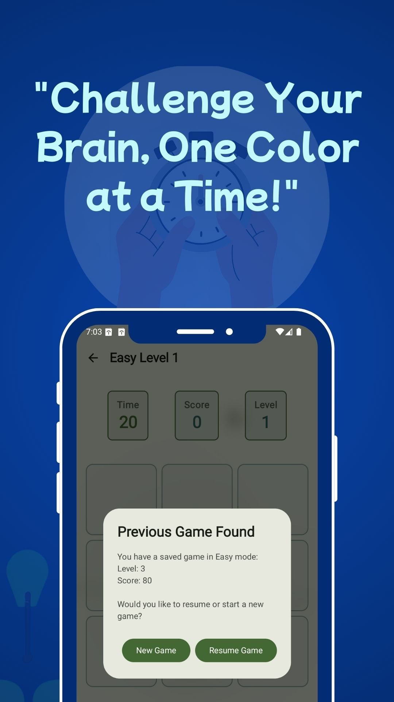
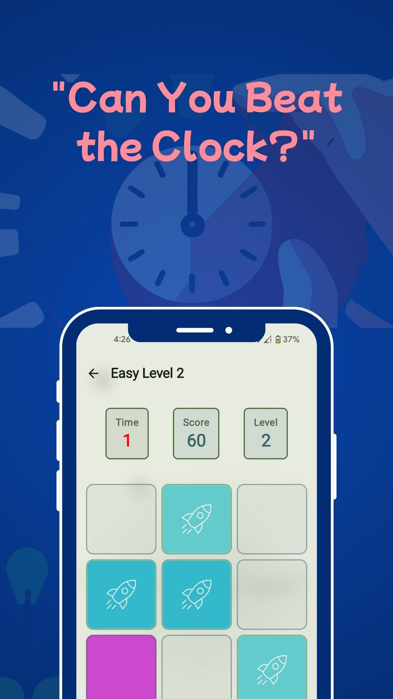
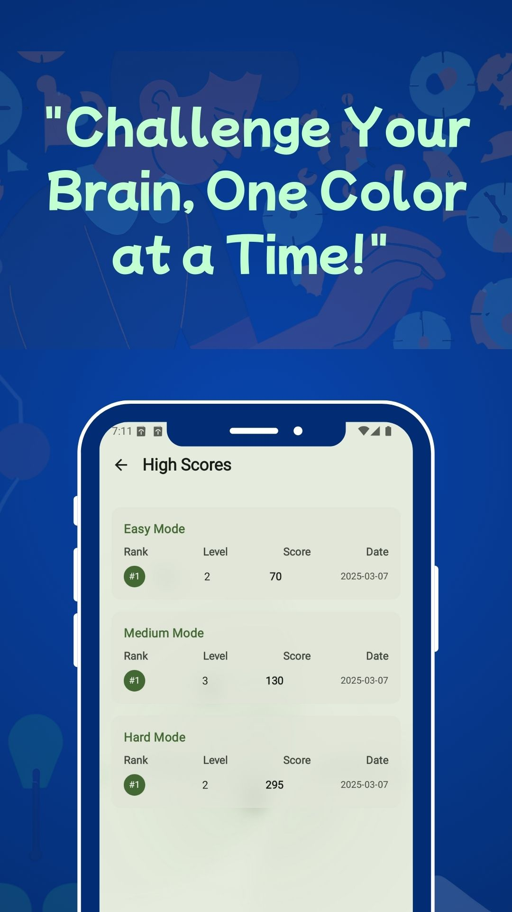

# 🎮 Color Matching Game

A beautiful and engaging color matching memory game built with Jetpack Compose. Test your memory and color recognition skills while enjoying smooth animations and dynamic gameplay!

## ✨ Features

- 🎯 Three difficulty levels (Easy, Medium, Hard)
- 🎨 Beautiful color combinations and animations
- 🏆 High score system
- 🌓 Light/Dark theme support
- 🎵 Sound effects
- 📈 Progressive difficulty
- 💫 Streak and combo system
- 💾 Game progress saving

## 🎯 How to Play

1. Choose your difficulty level:

   - Easy: 3x3 grid
   - Medium: 4x4 grid
   - Hard: 5x5 grid

2. Memorize the colors shown initially
3. Match pairs of colors before time runs out
4. Score points and unlock new levels
5. Beat your high score!

## 🎮 Game Mechanics

- Quick matches earn bonus points
- Maintain streaks for additional points
- Complete levels to unlock harder challenges
- Save your progress and resume anytime

## 🔧 Technical Details

- Minimum SDK: Android 7.0 (API level 24)
- Target SDK: Android 14 (API level 34)
- Built with Jetpack Compose
- Material Design 3 with dynamic theming
- Clean Architecture principles

## 📱 Screenshots

  
  
  
  

  
  
  
  

## 🚀 Latest Release

### Version v25.03.1.24

- Initial release
- Three difficulty levels
- High score system
- Sound effects
- Theme support
- Progress saving

## 📥 Download

Get it on the Google Play Store:
[Download Color Matching Game](https://play.google.com/store/apps/details?id=dev.toufikforyou.colormatching)

## 📝 Privacy Policy

This game:

- Does not collect personal data
- Does not require special permissions
- Does not contain advertisements
- Is suitable for all ages

## 🎯 Credits

Developed by MH TOUFIK
Design inspired by Material Design principles
Sound effects from [Source]

## 📞 Contact & Support

For support, feedback, or suggestions:

- Email: hello@toufikforyou.dev
- Twitter: [@toufikforyou](https://twitter.com/toufikforyou)
- Website: [toufikforyou.dev](https://toufikforyou.dev)

## 📃 License

Copyright © 2025 MH TOUFIK. All rights reserved.
